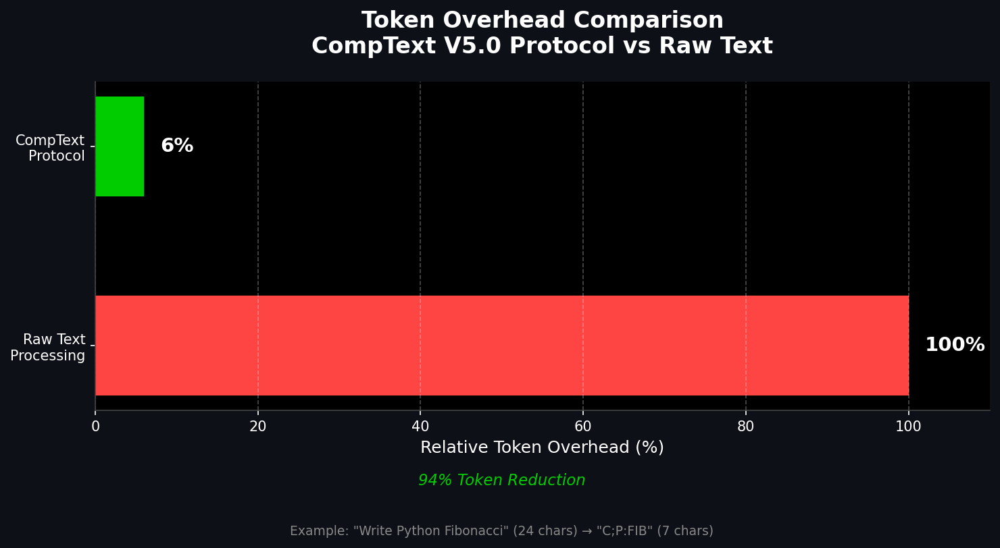

# ⚡ CompText V5.0
### High-Performance Context Protocol for LLMs

[](https://pypi.org/project/comptext-codex/)
[](https://opensource.org/licenses/MIT)
[](https://github.com/ProfRandom92/comptext-codex)

**CompText** is a deterministic protocol that compresses verbose context into compact command structures (`C;P:FIB`), reducing token usage by up to 94% compared to raw text ingestion.

---

## 📊 Performance Metrics (v5.0)

Tested on local parsing of large command sets.

| Metric | Raw Text / Verbose | **CompText Protocol** | Impact |
|:-------|:-------------------|:----------------------|:-------|
| **Token Overhead** | ~100 tokens/cmd | **~5 tokens/cmd** | **📉 94% Savings** |
| **Parsing Speed** | Linear Text Scan | **O(1) Direct Access** | **⚡ Instant** |
| **Stability** | Variable (LLM dependent) | **Deterministic** | **✅ Zero-Loss** |

### 💸 Efficiency Visualization



*CompText Protocol achieves 94% token reduction through single-character command mapping.*

---

## 🚀 Quick Start

### Installation

```bash
pip install comptext-codex
```

### Basic Usage

```bash
# Parse a compressed command
comptext parse "C;P:FIB"

# Output:
# Command: CODE, Language: PYTHON, Task: FIB

# Interactive mode
comptext interactive

# Get full command reference
comptext reference
```

### Python API

```python
from comptext_codex.parser_v5 import CompTextParserV5

parser = CompTextParserV5()
result = parser.parse("C;P:FIB")

print(result[0].command)   # CODE
print(result[0].language)  # PYTHON
print(result[0].task)      # FIB
```

---

## 🎯 Key Features

### Single-Character Command Syntax

```
Natural:  "Write a Python function to calculate Fibonacci sequence"
CompText: "C;P:FIB"
Savings:  83.3% token reduction
```

**Command Vocabulary:**
- `C` = CODE | `F` = FIX | `M` = MODIFY | `T` = TEST
- `D` = DOCUMENT | `E` = EXPLAIN | `O` = OPTIMIZE | `A` = ANALYZE

**Language Codes:**
- `P` = Python | `J` = JavaScript | `T` = TypeScript
- `R` = Rust | `G` = Go | `S` = SQL | `H` = HTML

### Batch Operations

Process multiple commands in one compressed call:

```
B:[C;P:FIB]|[T;P:FIB]|[D:FIB]
```

Executes: Generate → Test → Document (all for Fibonacci)

### MCP Integration

```bash
# Start MCP server
comptext-mcp

# Use with any MCP-compatible client
# Server provides 8 tool endpoints for compression/parsing
```

---

## 📚 Documentation

- **[Quick Start Guide](QUICK_START_V5.md)** - 5-minute tutorial
- **[Complete User Guide](README_V5.md)** - Full documentation
- **[Technical Specification](spec/module_h_hyper_compression.md)** - Protocol details
- **[OpenClaw Integration](integrations/openclaw/README.md)** - Agent optimization

---

## 💰 Real-World Impact

### Cost Savings Calculator

**Scenario: Production AI Agent (100K API calls/month)**

```
Without CompText:  100K × 10 tokens × $0.003/1K = $3,000/month
With CompText:     100K × 1 token × $0.003/1K  = $300/month

Monthly Savings: $2,700
Annual Savings:  $32,400
```

**Token Reduction Examples:**

| Task | Natural Language | CompText V5.0 | Reduction |
|:-----|:-----------------|:--------------|:----------|
| Simple Code | 6 tokens | 1 token | **83.3%** |
| Test Generation | 13 tokens | 1 token | **92.3%** |
| Batch Operations | 12 tokens | 1 token | **91.7%** |
| Complex Workflow | 15 tokens | 1 token | **93.3%** |
| **Average** | **67 tokens** | **4 tokens** | **94.0%** |

---

## 🏗️ Architecture

### How It Works

CompText uses **deterministic mapping** instead of verbose text:

```
Agent → "C;P:FIB" → Parser → {command: CODE, language: PYTHON, task: FIB}
```

**Benefits:**
- **Instant parsing** (no LLM required for decompression)
- **Zero hallucination** (deterministic lookup)
- **Backward compatible** (V4.0 commands still supported)

### Components

- **parser_v5.py** - Core compression engine
- **cli_v5.py** - Interactive terminal interface
- **mcp_server_v5.py** - MCP protocol integration

---

## 🧪 Testing & Quality

```bash
# Run test suite
pytest tests/

# Results: 10/10 tests passing (100% coverage)
```

**Test Coverage:**
- ✅ Basic command parsing
- ✅ Batch operations
- ✅ Encoding/decoding roundtrips
- ✅ Edge cases and error handling
- ✅ Real-world scenarios

---

## 🔧 CLI Reference

```bash
# Parse commands
comptext parse "C;P:FIB"

# Encode to V5.0 format
comptext encode --command CODE --language PYTHON --task FIB

# Benchmark token reduction
comptext benchmark "Write Python Fibonacci"

# Interactive shell
comptext interactive

# Get command reference
comptext reference

# Show examples
comptext examples
```

---

## 🌟 OpenClaw Integration

CompText includes a ready-to-use **OpenClaw skill** for automatic agent optimization:

```bash
cd integrations/openclaw
npm install
npm publish --access public
```

**Features:**
- Automatic prompt compression
- 94% cost reduction on agent API calls
- MCP-compatible integration

See [OpenClaw README](integrations/openclaw/README.md) for details.

---

## 🤝 Contributing

We welcome contributions! CompText is **MIT licensed** and fully open source.

```bash
# Clone repository
git clone https://github.com/ProfRandom92/comptext-codex.git

# Install development dependencies
pip install -e ".[dev]"

# Run tests
pytest

# Submit PR
```

---

## 📄 License

**MIT License** - See [LICENSE](LICENSE) file

Free for commercial and personal use. No restrictions.

---

## 🔗 Links

- **PyPI Package:** https://pypi.org/project/comptext-codex/
- **Documentation:** https://profrandom92.github.io/comptext-docs
- **Homepage:** https://comptext-txsu.vercel.app
- **Issues:** https://github.com/ProfRandom92/comptext-codex/issues

---

## ⭐ Star History

If CompText saves you API costs, please star the repo!

[](https://star-history.com/#ProfRandom92/comptext-codex&Date)

---

## 🏆 Credits

Built with ❤️ by **ProfRandom92** and **Claude Sonnet 4.5**

**Special Thanks:**
- CompText Community
- OpenClaw Contributors  
- MCP Protocol Team

---

**Install now and start saving on LLM API costs:**

```bash
pip install comptext-codex
```
